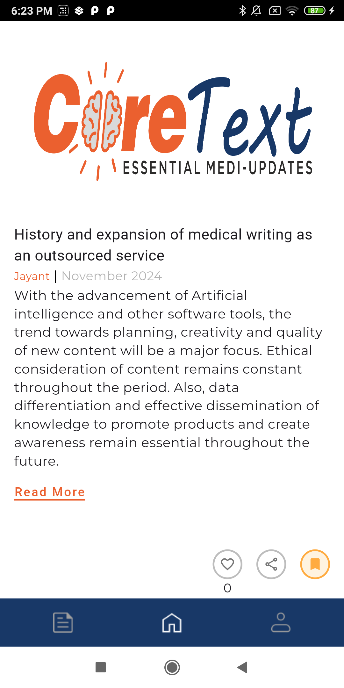
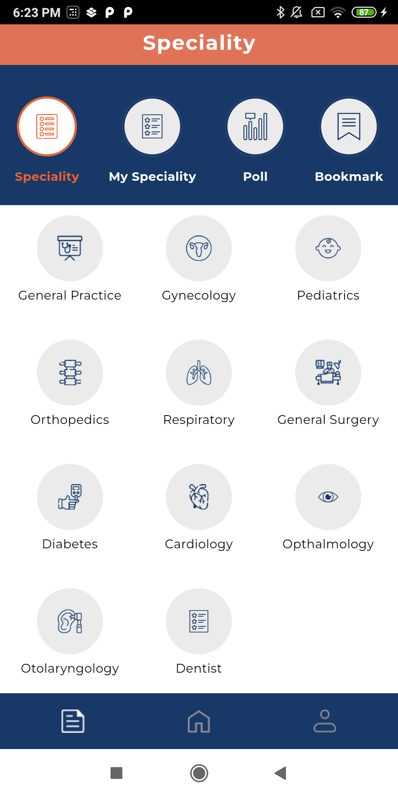
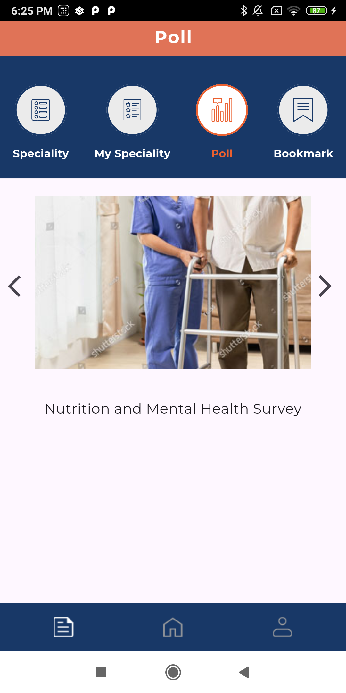
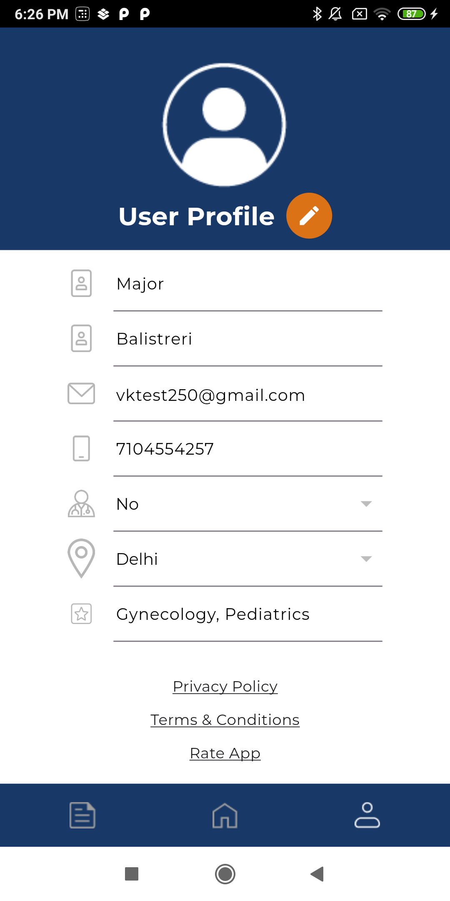
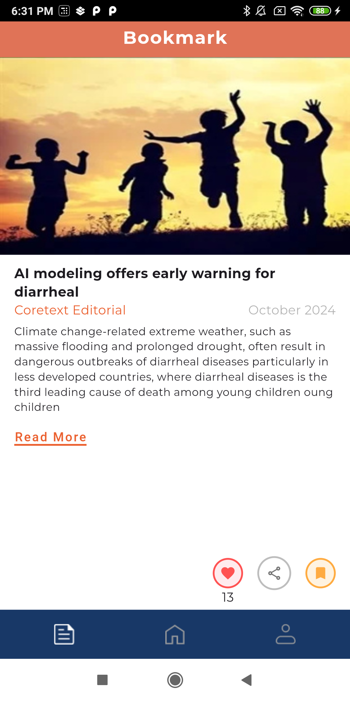
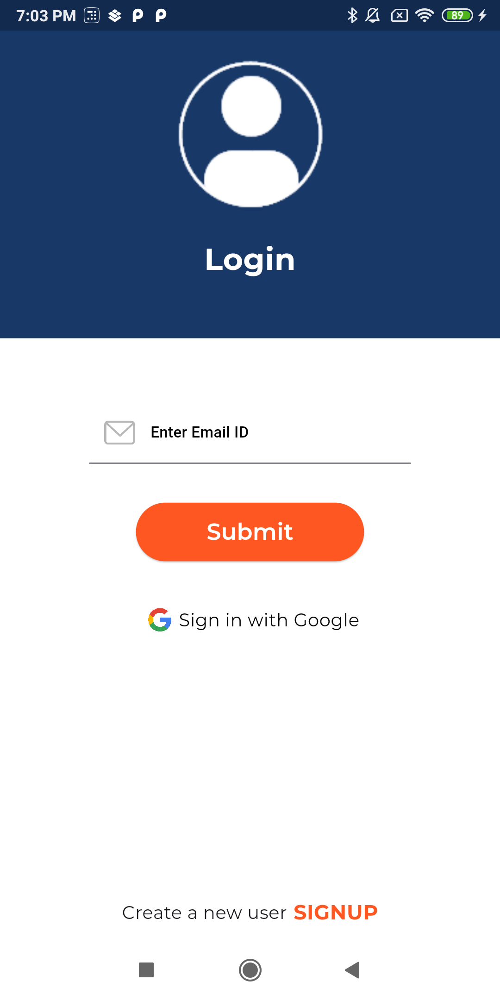
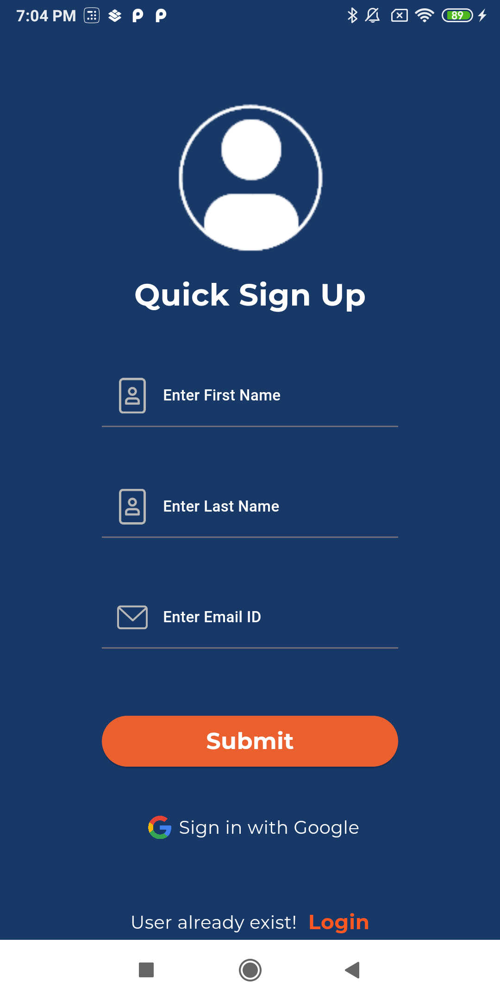

# CoretextApp

**Description** - 

Article Wall: This section is the most commonly visited section in the app. The main functionality is as follows:
* When an existing user opens the app, the first article in the article wall section is shown.
* A user can view new articles by swiping up.
Article Details Page:
* The article details will be a full-fledged website page.
* The article details section will show the article page in an embedded browser.
Interests page: The section will show the multiple sections.
My Interests:
* A user will be able to select one or more article categories/topics.
* The selected category articles will be shown on priority to the user.
* A user can select and unselect the article categories.
Topic wall (trending will be a category inside the topic wall)
* A list of categories/topics will be shown on the page.
Polls:
* A list of active polls will be displayed to the user.
* Every poll will show an image and title.
* If the user clicks on a poll, then the poll page will be opened.
* The poll page will show the following details:
* The website link will be opened in the section. There will not be any restrictions imposed by the app on the website page browsing and behavior.
Bookmarks:
* When the user clicks on the bookmarks, the bookmarks wall will be shown to the user.
* The bookmarks wall will show the articles bookmarked by the user.
* If no bookmarks are found, then the message “No articles found” will be shown to the user.

**Screenshots** -

